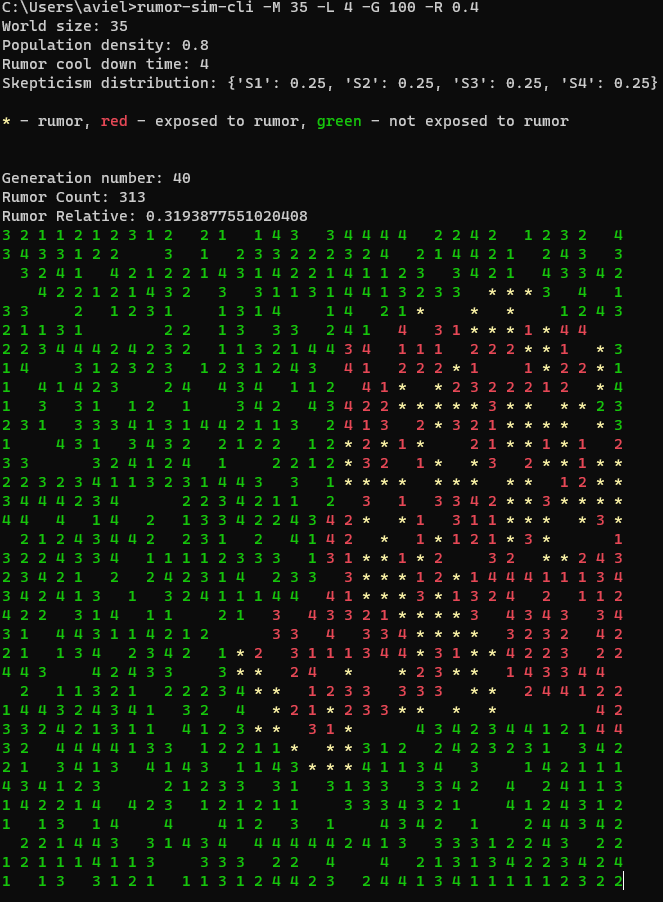
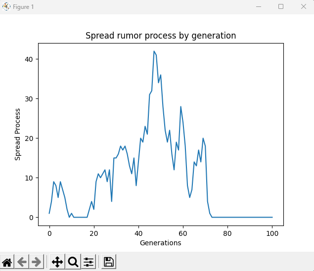
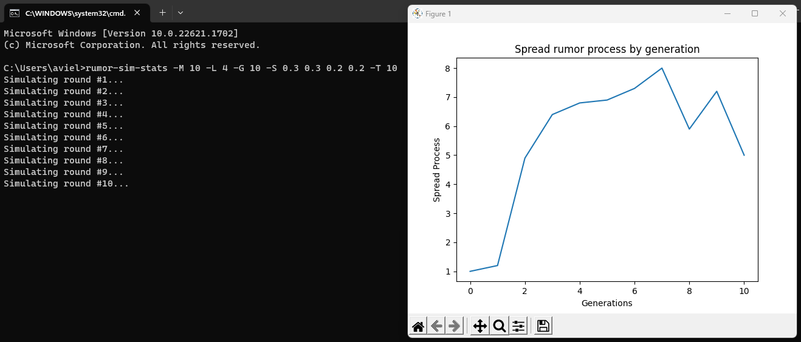
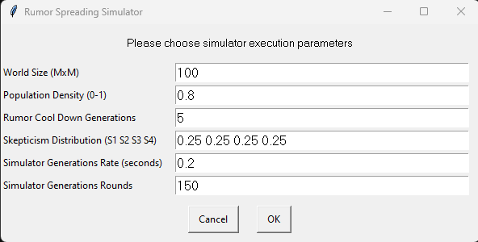
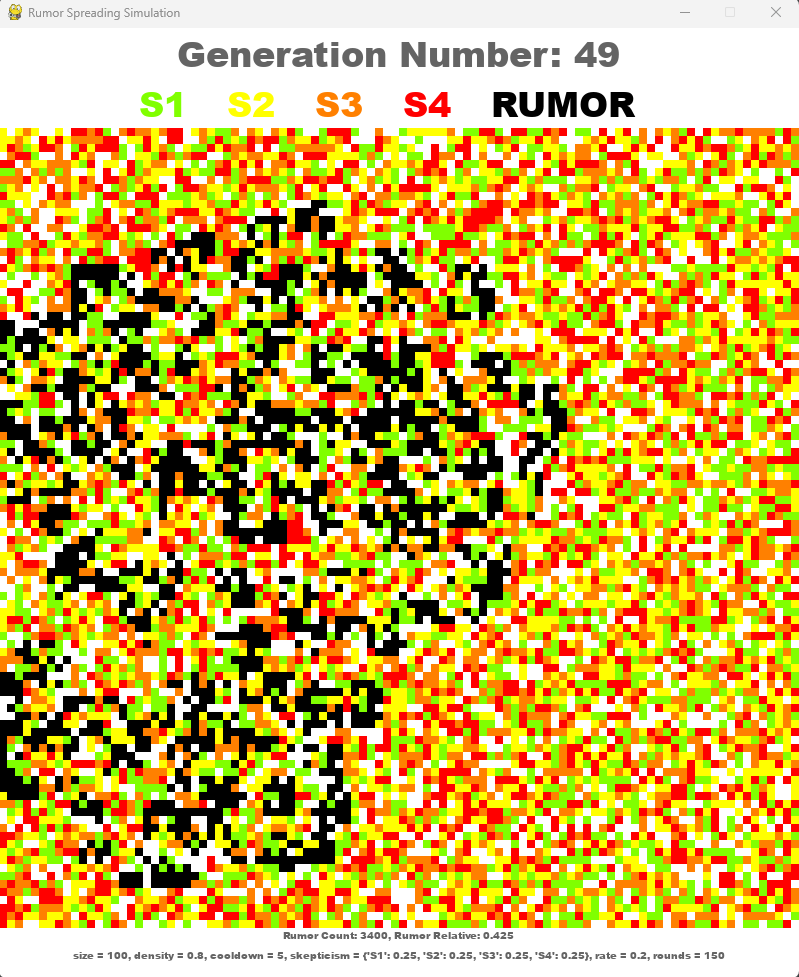
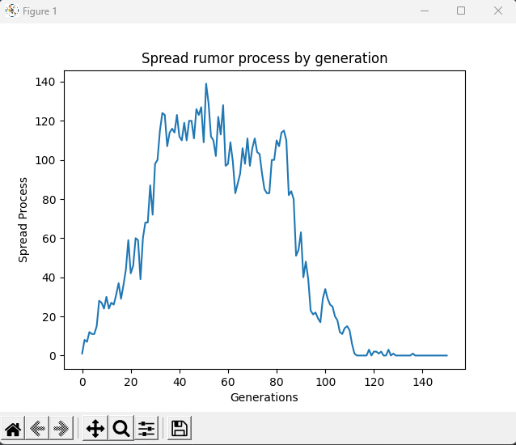

# Rumor Spreading Simulator #
A basic interactive simulator for testing the effect of rumor spreading speed
in a population based on physical proximity and level of skepticism.

The population consists of 4 types of people:
* S1 - upon rumor spread, tell all friends in next generation.
* S2 - upon rumor spread, tell all friends in next generation with probability of 2/3.
* S3 - upon rumor spread, tell all friends in next generation with probability of 1/3.
* S4 - upon rumor spread, tell nobody in next generation.

A person who spread a rumor in current generation will not be able to that for the next L ("cool down") generations.
In addition, a person who get the rumor from more than 2 friends decrease the level of 
skepticism by one (e.g. S2->S1) for the next generation only.

## Installation ##

```commandline
python3 -m pip install rumor-spreading-simulator
```

## Usage ##

### CLI ###
May be used for small executions
```commandline
rumor-sim-cli -h
rumor-sim-cli -M 35 -L 4 -G 100 -R 0.4
```





### STATS ###
May be used for research purposes
```commandline
rumor-sim-stats -h
rumor-sim-stats -M 10 -L 4 -G 10 -S 0.3 0.3 0.2 0.2 -T 10
```




### GUI ###
May br used for visualization of the spreading process
```commandline
rumor-sim-gui
```







### python ###
```python
from rumor_spreading_simulator.engine.simulator import RumorSpreadingSimulator

simulator = RumorSpreadingSimulator(
    world_size=50,
    population_density=0.7,
    rumor_cool_down=4,
)
simulator.next_generation()
simulator.jump_generation(5)

print(simulator.generation, simulator.rumor_count, simulator.rumor_relative)
```

## Remarks ##
* No wrap around model, makes the analysis hard and unstable
* Friend are considered to be the 8 (if exist) neighbors 
* The first person always spread the rumor to all local friends (regardless of his type)
